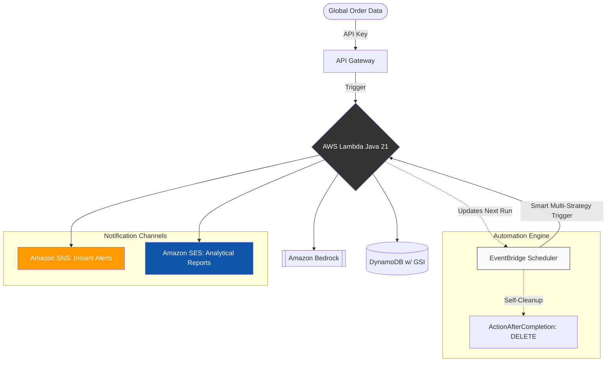

# 🛡️ SentinelStream: Enterprise AI-Driven Fraud Prevention Engine


SentinelStream is a high-performance, AI-driven fraud detection engine designed for **cross-border e-commerce**. Leveraging the reasoning power of **Amazon Bedrock (Nova-2-Lite)**, the system evaluates transaction risks in real-time and generates automated, timezone-aware deep analysis reports.

---
## 💼 Business Value & Freelance-Ready Advantages
*   **Extreme Cost-Efficiency**: Built on a 100% Serverless architecture. **Zero cost when idle**—the most budget-friendly solution for SMEs.
*   **Enterprise-Ready Performance**: Optimized with **Java 21** and **AWS Lambda SnapStart** to significantly mitigate cold start latency. While AI inference naturally requires processing time (typically 1-3s), the core system architecture is designed for high-concurrency and rapid execution.
*   **Localization Support**: Built-in multi-language reporting (English, Traditional/Simplified Chinese, Japanese, Korean, French) that adapts to the user's timezone.
*   **Production-Ready Reliability**: Includes AI "Safety Net" logic and structured JSON validation to ensure 24/7 automated workflow stability.
---
## 🚀 Core Functional Modules
### 1. Real-time AI Fraud Detection
*   **Intelligent Risk Modeling**: Analyzes correlations between IP geolocation, shipping destinations, and transaction amounts.
*   **Automated Mitigation**: Transactions with a risk score > 0.75 are automatically marked as `REJECTED`.
*   **Localized Alerts**: Instantly triggers context-aware, **multi-language email alerts via Amazon SNS**, ensuring your security team receives actionable threat alerts in their native language and timezone.
### 2. Intelligent Trend Reporting (Auto-Pilot)
*   **Dynamic Scheduling**: Supports Interval-based, Periodic, and Specific Date reporting strategies via **EventBridge Scheduler**.
*   **AI Insights**: Automatically aggregates fraud patterns and uses **Nova AI** to generate professional business intelligence summaries delivered via **Amazon SES**.
---
## 🏗️ System Architecture

> **Note**: The **Automation Engine** features a triple-strategy scheduler (**INTERVAL**, **PERIODIC**, and **SPECIFIC**) to accommodate diverse corporate auditing cycles. Detailed logic is provided in the [Specifications](#-intelligent-scheduling-specifications) section below.
---
## ⚙️ Intelligent Scheduling Specifications
To meet diverse corporate audit requirements, the system supports three distinct calculation logics:
*   **1. INTERVAL (Accumulative Rolling)**
    *   **Logic**: Triggers every fixed number of days (e.g., "Every 3 days").
    *   **Best For**: High-volume merchants who need continuous data processing without gaps or overlaps.
*   **2. PERIODIC (Standard Calendar)**
    *   **Logic**: Aligns strictly with business cycles (Weekly on Mondays, Monthly on the 1st).
    *   **Best For**: Routine management reviews and standard operational reporting.
*   **3. SPECIFIC (Precision Targeting)**
    *   **Logic**: Targets a specific day of the week, month, or year (e.g., "The 15th of every month").
    *   **Best For**: Specialized financial or compliance audits. The engine intelligently handles month-end variances (e.g., Leap years or February 28th).
---
## 📧 Email Delivery & Production Readiness
### 📬 Localized Dual-Channel Messaging
*   **High-Priority Alerts (SNS)**: Instant, **multi-language push notifications** for immediate risk mitigation when high-profile threats are detected.
*   **Analytical Reports (SES)**: Deep-dive AI reports (up to 3,000 chars) delivered via Amazon SES for professional formatting and multi-language support.
### 🛡️ Production Anti-Spam Strategy
In the demo environment, emails may be flagged as spam due to AWS Sandbox limitations. For **Production Deployment**, I provide full support for:
*   **Custom Domain Identity**: Verifying your business domain via AWS SES.
*   **DKIM & SPF Configuration**: Setting up DNS records to ensure maximum deliverability and professional branding.
---
## 🛠️️ Reliability & Security Best Practices
*   **SnapStart Optimization**: Specifically configured to bypass Java cold starts, delivering sub-second initialization for high-availability endpoints.
*   **Security-First Design**: Implements API Key authentication, CORS restrictions, and strictly adheres to **IAM Least Privilege** principles for all resource interactions.
*   **Robust LLM Handling**: Built-in **Boundary-based Parsing** to handle non-standard or "chatty" AI responses, ensuring JSON data integrity.
*   **Optimized I/O**: Leverages AWS SDK v2 with **Static Initialization** and **Singleton Patterns** for maximum connection and resource reuse.

---
## 🧪 Experience the Flow (Testing & Validation)
### 📸 Execution Results
> **💡 Client Note**: These screenshots demonstrate the system's dual-action capabilities—real-time transaction protection and fully customizable AI reporting schedules.
---
#### 🚨 **Real-time Alert**: Instant, context-aware **multi-language risk notification** sent via SNS when high-risk transactions are intercepted.


---
#### 📊 **Periodic Report**: Deep AI Analysis via SES providing aggregation and actionable business advice.

<details>
<summary>🔎 View Full AI Report Text Template (Click to Expand)</summary>

```text
🛡️ SENTINEL STREAM | AI Fraud Trend Report
━━━━━━━━━━━━━━━━━━━━━━━━━━━━━━━━━━━━━━━━━━
📅 Analysis Time: 2026-05-08 03:30:17
📊 Monitoring Status: System Operating Normally
━━━━━━━━━━━━━━━━━━━━━━━━━━━━━━━━━━━━━━━━━━

【 AI Deep Dive Analysis 】
------------------------------------------
【 Fraud Analysis Report 】
The current period under review shows a total of six flagged incidents. Each case has been categorized based on specific audit triggers, highlighting various red flags related to transaction risk, geographic inconsistencies, and potential illicit activity.

【 Audit Reasons Distribution 】
■ High-risk transaction: IP location inconsistent with shipping destination and unusually large amount for this route. (Occurred 2 times)
■ High-risk geopolitical route, unusually large amount, and potential sanctions evasion. (Occurred 1 time)
■ High-value transaction with potential IP-to-destination inconsistency and geopolitical risk; strong indicators of fraud. (Occurred 1 time)
■ High-value transaction to Taiwan from a potentially mismatched IP; inconsistent geography and amount suggest fraud or money laundering. (Occurred 1 time)
■ High geopolitical risk due to Iran destination, IP-to-location mismatch, and unusually large transaction amount indicating potential fraud. (Occurred 1 time)

【Key Observations】
The incidents demonstrate several recurring themes. First, IP-to-destination mismatches appear in five out of six cases, suggesting potential use of proxy servers, virtual private networks, or deliberate obfuscation techniques. Second, unusually large transaction amounts for specific routes or regions raise concerns about money laundering or attempts to bypass transaction limits. Third, multiple transactions involve high-risk geopolitical zones, including Taiwan and Iran, which are subject to international sanctions and heightened scrutiny.

【Risk Assessment】
These findings indicate a strong potential for fraudulent activity, including money laundering, sanctions evasion, and other illicit financial operations. The combination of geographic inconsistencies, high transaction values, and high-risk destinations creates a multi-layered risk profile that warrants immediate further investigation.

【 Recommended Actions 】
■ Conduct detailed forensic analysis of IP addresses and transaction histories for each flagged incident.
■ Engage compliance and legal teams to assess exposure to international sanctions, particularly concerning Iran and Taiwan.
■ Implement enhanced due diligence for future transactions involving similar high-risk routes, large amounts, or inconsistent geographic data.
■ Consider temporary hold or review procedures for transactions displaying similar patterns until thorough validation is completed.

【Conclusion】
The six incidents collectively paint a concerning picture of potential fraud and illicit activity. Proactive monitoring, deeper investigation, and targeted interventions are essential to mitigate these risks effectively.

━━━━━━━━━━━━━━━━━━━━━━━━━━━━━━━━━━━━━━━━━━
💡 Tech Note: Generated automatically by Amazon Nova AI model.
⚠️ Disclaimer: AI suggestions are for reference only. Review before action.
🌐 Best Regards, SentinelStream Monitoring Center

------------------------------------------
This report is automatically generated by SentinelStream. To manage settings, please contact the administrator.
```
</details>

---
#### 🛡️ **Order Engine**: **POST /submit** - Validates transaction risk scores using real-time Bedrock reasoning.


---
#### ⚙️ **Schedule Config**: **POST /settings** - Dynamically configures reporting strategy (Interval/Periodic/Specific).


---
## ⚙️ Technical Highlights
### 🏛️ Core Infrastructure
*   **High-Performance Runtime**: Java 21 (**Amazon Corretto**) on AWS Lambda, optimized with **SnapStart** for sub-second cold starts.
*   **AI Engine**: Amazon Bedrock (**amazon.nova-2-lite-v1:0**) for low-latency reasoning and cost-effective inference.
*   **Serverless Backbone**: 100% elastic scaling using API Gateway, DynamoDB (On-demand), and Amazon SNS.
*   **Infrastructure as Code (IaC)**: Managed via **AWS SAM** for reliable, one-click environment replication.
### 🛠️ Advanced Engineering
*   **Deployment Optimization**: Utilized **Maven Shade Plugin** with `ServicesResourceTransformer` to resolve AWS SDK resource conflicts and minimize Shaded JAR size.
*   **Event-Driven Scheduling**: Deep integration with **EventBridge Scheduler** to manage complex, stateful reporting lifecycles.
*   **Full-Stack Observability**: Integrated **AWS X-Ray** (Tracing: Active) to monitor AI inference latency and identify system bottlenecks.
*   **I/O Efficiency**: Implementation of **Static Initialization** and **Singleton Patterns** for optimal AWS SDK client reuse.
---
## 🚀 Getting Started & Deployment
> **💡 Note for Clients**: This project is production-ready. While I handle the entire environment setup, IAM hardening, and DNS configuration for my clients, you can review the deployment logic below to evaluate the project's architecture and maintainability.
### Prerequisites
*   AWS CLI & [AWS SAM CLI](https://aws.amazon.com/tw/serverless/sam/) installed and configured.
*   Java 21 (Amazon Corretto) & Maven 3.9+.
*   Amazon Bedrock Model Access enabled for `nova-2-lite`.
### Deployment Logic
```bash
# 1. Package the application into a Shaded JAR
mvn clean package -DskipTests

# 2. Build and Deploy to your AWS environment
sam deploy --no-confirm-changeset
```
---
## 🧪 Testing the API
**After successful deployment**, you can verify the integration using the pre-configured **Postman Collection** included in this repo or the following **cURL** commands:
### 📡 API Endpoints
*   **Submit Order**: `POST {{baseUrl}}/submit`
*   **Update Settings**: `POST {{baseUrl}}/settings`
> **Note**: The `{{baseUrl}}` is your unique endpoint generated by AWS (found in the SAM deployment outputs).
#### 1. Submit a Transaction for AI Analysis
```bash
curl -X POST {{baseUrl}}/submit \
     -H "X-Api-Key: YOUR_API_KEY" \
     -H "Content-Type: application/json" \
     -d '{
          "userId": "user_normal_001",
          "amount": 50.0,
          "currency": "USD",
          "ipAddress": "1.33.0.1",
          "shippingCountry": "Japan"
        }'
```
#### 2. Update Reporting Strategy
```bash
curl -X POST {{baseUrl}}/settings \
     -H "X-Api-Key: YOUR_API_KEY" \
     -H "Content-Type: application/json" \
     -d '{
          "strategy": "INTERVAL",
          "intervalDays": 3,
          "startDate": "2026-05-02",
          "sendTime": "10:30",
          "targetTimeZone": "America/New_York"
        }'
```
---
## 📞 Contact & Collaboration
I specialize in **AWS Serverless Architecture** and **Enterprise AI Integration**.
If you are looking for a developer who can:
*   Build **high-concurrency**, low-latency serverless systems.
*   Implement **automated AI workflows** (Bedrock / OpenAI).
*   Optimize **Java performance** in cloud environments.

Let's connect and discuss your project on **[Upwork](您的Upwork個人檔案連結)**!

