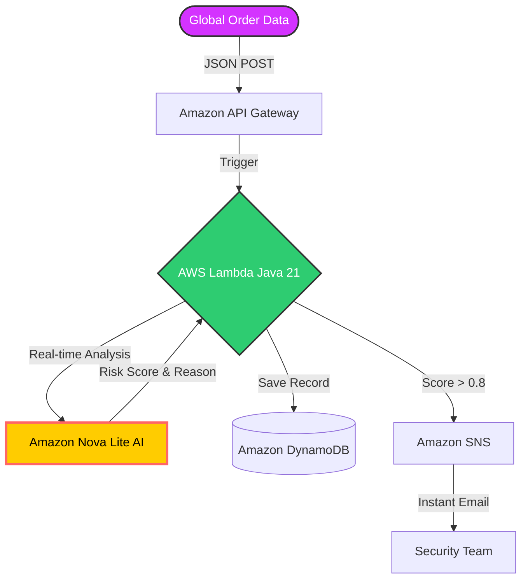

# SentinelStream: AI-Driven Cross-Border Fraud Prevention
> **A High-Concurrency, Cloud-Native Fraud Detection Engine for Global E-commerce**

**Project for: [2026 Amazon Nova AI Hackathon]**

## 🌟 Project Overview
SentinelStream is a sophisticated serverless fraud detection system designed to protect global e-commerce platforms from sophisticated cross-border transaction fraud. By leveraging **Java 21**, **Amazon Nova Lite**, and **Event-Driven Architecture**, SentinelStream provides real-time risk assessment and automated incident response with ultra-low latency.

### 🏆 Key Value Propositions
*   **Intelligent Reasoning**: Powered by **Amazon Nova Lite** to analyze complex fraud patterns (e.g., geopolitical risks, IP-mismatches).
*   **Explainable AI (XAI)**: Generates human-readable reasons for every fraud decision to enhance auditability.
*   **Automated Response**: Triggers instant high-risk! alerts via **Amazon SNS** for critical threats (Score > 0.8).
*   **Scalable Persistence**: Stores all transaction insights in **Amazon DynamoDB** for long-term fraud trend analysis.

---

## 🛠️ Technical Stack
- **AI/ML**: Amazon Bedrock (Model: `amazon.nova-lite-v1:0`)
- **Backend**: Java 21 (Optimized with Virtual Threads for event-driven processing), leveraging AWS Lambda Core libraries for minimal cold-start latency.
- **Cloud Infrastructure**: AWS Lambda, Amazon API Gateway
- **Data & Messaging**: Amazon DynamoDB, Amazon SNS
- **DevOps**: AWS SAM, Docker, Maven (Shade Plugin for Uber-Jar)
- **Security**: IAM Least Privilege Policies

---

## 🏗️ System Architecture


1.  **Ingestion Layer**: **Amazon API Gateway** receives global transaction data (JSON).
2.  **Processing Layer**: **AWS Lambda (Java 21)** orchestrates the workflow and performs feature extraction.
3. **Intelligence Layer**: **Amazon Nova Lite** performs real-time inference to generate a risk_score and reason. (Chosen for its **superior speed-to-cost ratio** and native integration with the AWS ecosystem).
4.  **Persistence Layer**: **Amazon DynamoDB** stores transaction records and AI-generated insights.
5.  **Action Layer**: **Amazon SNS** sends instant email notifications for high-risk anomalies.

---

## 🚀 Getting Started

### Prerequisites
- JDK 21 & Maven 3.9+
- AWS CLI configured with appropriate credentials

### 📝 Configuration Note
> **Critical Step**: Before deploying, please update the `Endpoint` in `template.yaml` (Line 22) with your own email address to receive real-time fraud alerts. After deployment, check your inbox and click **"Confirm Subscription"** in the AWS notification email to enable the SNS service.

### Deployment
1. **Build the Project**:
   ```bash
   mvn clean package -DskipTests
   ```
2. **Deploy to AWS**:
   ```bash
   sam deploy --no-confirm-changeset
   ```
## 🚀 Live Demo & API Testing
> **Note**: This is a **POST** endpoint. Accessing it directly via a web browser (GET) will result in a `Missing Authentication Token` error.

- **Endpoint**: `https://prwjcz06oc.execute-api.us-east-1.amazonaws.com/Prod/submit`
- **Recommended Tool**: Use [Postman](https://www.postman.com) or `curl`.

### 📝 API Usage Example

**1. Request Payload (Input):**
```json
{
    "userId": "user_suspect_125",
    "amount": 999999.9,
    "currency": "USD",
    "ipAddress": "185.225.69.1",
    "shippingCountry": "Ukraine"
}
```
**2. System Response (Output):**
```json
{
  "id": "78430d89-f61a-4b9b-a599-3aceba926476",
  "userId": "user_suspect_125",
  "amount": 999999.9,
  "currency": "USD",
  "ipAddress": "185.225.69.1",
  "shippingCountry": "Ukraine",
  "status": "REJECTED",
  "riskScore": 0.99,
  "riskReason": "Inference blocked by safety filters - potential high-risk anomaly.",
  "createdAt": "2026-03-16T02:33:03.263277611"
}
```

---

✨ *<span style="color: #ff4d4f;">Developed by **Iris** for the **2026 Amazon Nova AI Hackathon**</span>*


