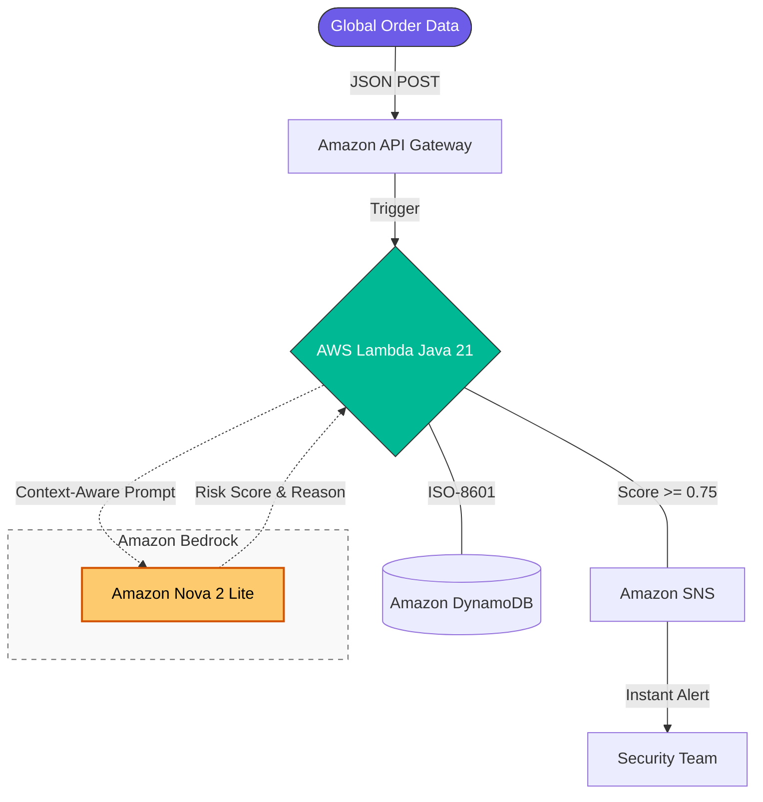

# 🛡️ SentinelStream: Real-time AI-Driven Cross-Border Fraud Prevention


> **A High-Concurrency, Cloud-Native Fraud Detection Engine optimized for AWS Serverless.**
> *Developed by **Iris** for the **2026 Amazon Nova AI Hackathon** & Career-Focused Cloud-Native Excellence.*

---

## 📖 Project Overview
**SentinelStream** is an advanced, AI-driven fraud prevention system designed for **high-stakes cross-border e-commerce**. It evaluates transaction risks in real-time by analyzing geolocation patterns (IP vs. shipping address) and geopolitical risks using **Generative AI (Amazon Bedrock)**.

Originally developed as a Spring Boot application, this project was **significantly re-engineered** into a lightweight **Serverless (Java 21)** architecture to eliminate framework overhead, achieve **near-instant warm starts**, and ensure maximum cost-efficiency.

---

## 💎 Key Value Propositions
- **Context-Aware Fraud Scoring**: Replaces rigid rule-based engines with dynamic LLM reasoning (Amazon Nova 2) for complex risk evaluation.
- **Optimized Performance**: Achieved **sub-2s average response times (Warm Start)** by refactoring to a pure Java Lambda runtime and optimizing SDK client lifecycles.
- **Enterprise Stability**: Implemented robust JSON extraction and fallback mechanisms to handle non-deterministic AI outputs reliably.
- **Event-Driven Resilience**: Triggers instant asynchronous alerts via **Amazon SNS** for critical threats (Score >= 0.75).

---

## 🏗️ System Architecture



---

### ⚡ Key Architectural Decisions
- **De-Springify (Cold Start Optimization)**: Eliminated Spring Boot dependency scanning to slash **Lambda Init Duration from ~10s to <1.5s** (Comparing **Spring Boot Fat JAR** vs. **Plain Java Shaded JAR**).
- **Static Initialization**: Optimized AWS SDK Clients (DynamoDB, SNS, Bedrock) using singleton patterns to maximize connection reuse and minimize latency in warm environments.
- **Robust Extraction**: Implemented boundary-based JSON parsing (`indexOf("{")`) to handle conversational LLM responses reliably.
- **Inference Configuration**: Optimized `max_new_tokens: 1000` and `temperature: 0.1` for consistent, professional-grade AI reasoning.

---

## 🛠️ Technical Stack

- **Runtime**: Java 21 (Amazon Corretto)
- **Infrastructure**: AWS Lambda, Amazon API Gateway (Serverless)
- **AI/ML**: Amazon Bedrock (Model: `amazon.nova-2-lite-v1:0`)
- **Storage**: Amazon DynamoDB (NoSQL)
- **Messaging**: Amazon SNS (Simple Notification Service)
- **DevOps**: **AWS SAM** (Infrastructure as Code), **Maven Shade Plugin** (**Transitioned to Shaded JAR** with `ServicesResourceTransformer` to minimize deployment size and resolve AWS SDK resource conflicts).


### 🛡️ Security First (Least Privilege Principle)
*   **Granular IAM Policies**: Restricted the Lambda function to only `bedrock:InvokeModel` permissions for specific **Inference Profiles**, minimizing the blast radius.
*   **Secure Environment Management**: Sensitive resource identifiers are injected via **Environment Variables**, ensuring zero hardcoded configuration.

---

## 🚀 Getting Started

### Prerequisites

- **JDK 21 & Maven 3.9.x**
- **AWS CLI & SAM CLI** configured with IAM credentials.
- **Amazon Bedrock Access**: Ensure `Nova-2-lite` is enabled in your AWS Region.

### ⚠️ Configuration Note (Critical Step)

Before deploying, please update the **Endpoint** in `template.yaml` (Line 22) with your own email address to receive real-time fraud alerts. After deployment, **check your inbox** and click **"Confirm Subscription"** in the AWS notification email to enable the SNS service.

### Deployment (Fast Track)
1. **Build the project (Shaded Fat JAR for Lambda)**:
   ```bash
   mvn clean package -DskipTests
   ```
2. **Deploy to AWS (Automated Deployment)**:
   ```bash
   sam deploy --no-confirm-changeset
   ```

---

## 📊 Live Demo & API Usage Example

> [!IMPORTANT]
> **Performance Note (Cold vs. Warm Start)**
> - **Cold Start (~6.2s)**: Initial request includes Lambda environment provisioning and Amazon Bedrock model initialization.
> - **Warm Start (~1.9s)**: Subsequent requests leverage pre-warmed environments for high-speed AI inference.

> [!TIP]
> **Testing Tools**: This is a `POST` endpoint. Please use **Postman**, **Insomnia**, or `curl`. Accessing via browser (`GET`) will return a `403 Forbidden` error.

### API Usage Example

**Endpoint**: `POST /orders`  
**Header**: `Content-Type: application/json`

#### 1. Request Payload (High-Risk Scenario):
```json
{
  "userId": "user_suspect_125",
  "amount": 999999.9,
  "currency": "USD",
  "ipAddress": "185.225.69.1",
  "shippingCountry": "Ukraine"
}
```
#### 2. AI-Enhanced System Response (200 OK):
```json
{
  "id": "c5e0c0ae-7335-4b56-a77c-57a5f5e50b9e",
  "userId": "user_suspect_125",
  "amount": 999999.9,
  "currency": "USD",
  "ipAddress": "185.225.69.1",
  "shippingCountry": "Ukraine",
  "status": "REJECTED",
  "riskScore": 0.95,
  "riskReason": "High transaction amount of $999,999.90 combined with destination Ukraine and IP address 185.225.69.1 (registered in Russia) indicates a strong IP-location mismatch. Geopolitical tensions between Russia and Ukraine increase the likelihood of fraudulent activity, money laundering, or sanctions evasion.",
  "createdAt": "2026-03-24T09:18:06.238392090Z"
}
```
> 🔍 **Why this is fraud?**
> The AI detected a sophisticated geopolitical anomaly: the **IP originates from Russia** (185.225.69.1) while the **destination is Ukraine**, involving a massive transaction amount ($999,999). This suggests potential **sanctions evasion or money laundering**—complex risks that traditional rule-based engines typically fail to identify.

---

## 💡 Closing Thoughts

**SentinelStream** reflects my ability to resolve real-world performance bottlenecks by identifies framework-level overhead. By transitioning from monolithic frameworks to a high-performance **Serverless Shaded JAR** architecture, I achieved a significant reduction in infrastructure latency while integrating advanced **Generative AI** for critical fraud prevention.


