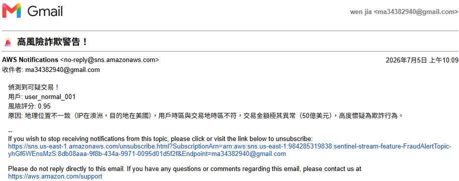
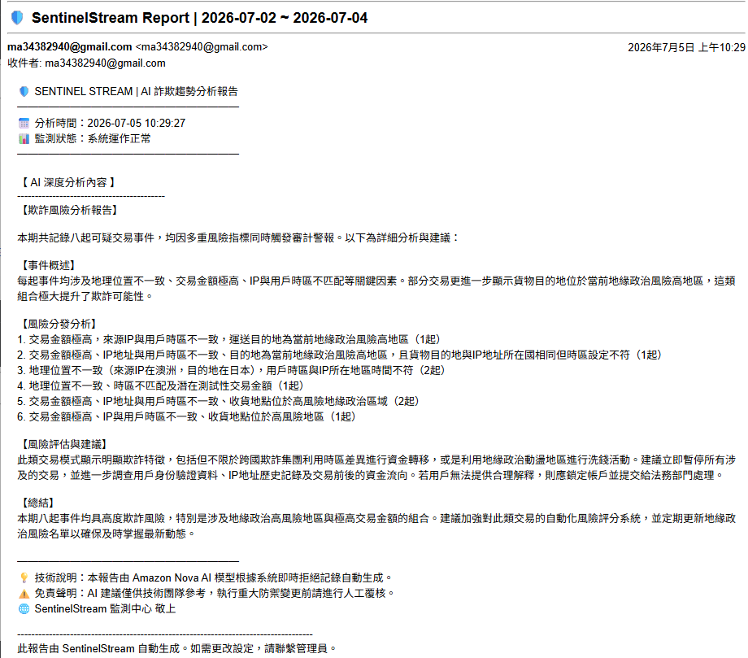
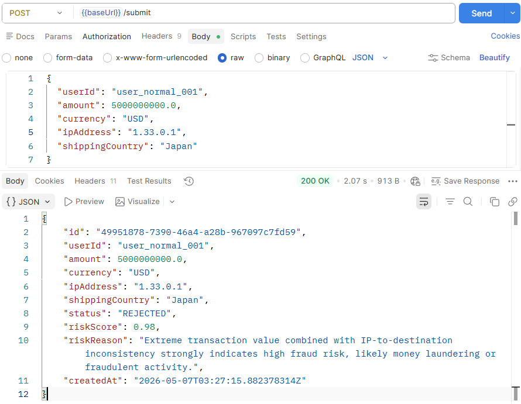
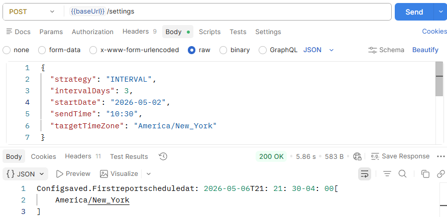
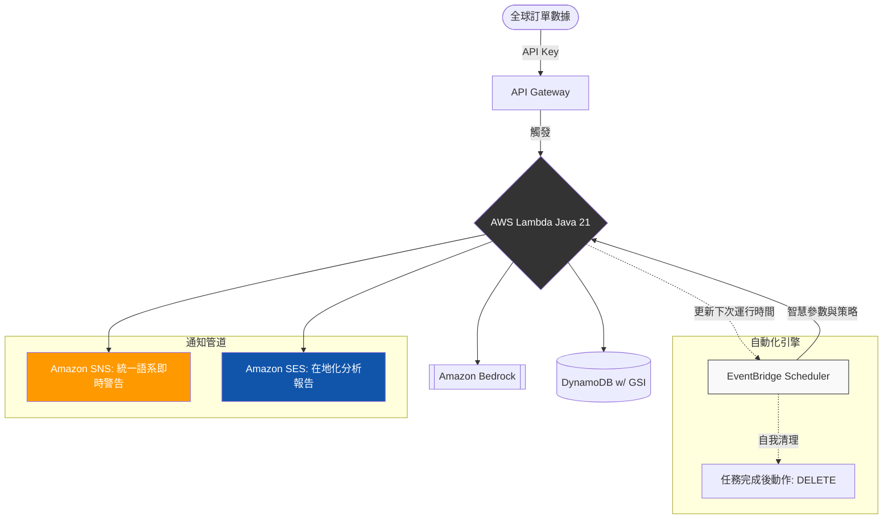

# 🛡️ SentinelStream：企業級 AI 驅動防詐騙引擎


SentinelStream 是一款專為**跨境電商**量身打造的高效能、AI 詐騙偵測引擎。本系統利用 **Amazon Bedrock (Nova-2-Lite)** 的強大推理能力，實現交易風險的即時評估，並提供高度可配置的自動化排程報告機制。

---

## 🧪 流程體驗 (測試與驗證)
### 📸 執行結果預覽
> **💡註**：以下截圖展示了系統的雙重核心能力——即時交易防護以及全自定義的 AI 報告排程。
---
#### 🚨 **即時警告 (Real-time Alert)**：當系統攔截到高風險交易時，會立即透過 SNS 發送具備情境感知的多國語言風險通知。


---
#### 📊 **定期報告 (Periodic Report)**：透過 SES 提供 AI 深度分析報告，內容包含數據彙整與具備商業價值的策略建議。


---
#### 🛡️ **訂單引擎 (Order Engine)**：**POST /submit** - 透過 Amazon Bedrock 的即時推理技術，驗證每筆交易的風險評分。


---
#### ⚙️ **排程配置 (Schedule Config)**：**POST /settings** - 動態設定報告策略，支援「固定間隔」、「定期循環」或「指定日期」等多元需求。


---

## 💼 商業價值與接案核心優勢
*   **極致成本效益**：基於 100% 全無伺服器 (Serverless) 架構開發。**閒置時零成本**——是中小企業 (SME) 最具預算友好的自動化方案。
*   **企業級效能表現**：採用 **Java 21** 與 **AWS Lambda SnapStart** 技術，克服冷啟動延遲。雖然 AI 推理需處理時間 (約 1-3s)，但核心架構專為高併發與快速反應而設計。
*   **彈性的多語系配置**：完整支援六種語系，並採「即時監控」與「分析報告」雙軌獨立語系邏輯。
*   **生產環境可靠性**：內建 AI「安全網」邏輯與結構化 JSON 校驗，確保自動化工作流 24/7 穩定運行。

---

## 🚀 核心功能模組
### 1. 即時 AI 詐騙偵測
*   **智慧風險建模**：深度分析 IP 地理位置、收件地址與交易金額之關聯性。
*   **自動化風險阻斷**：風險評分超過 0.75 的交易將自動標記為 `REJECTED` (拒絕)。
*   **系統級監控語言**：支援自定義統一監控語系。確保無論訂單來源，全球安全團隊皆能接收格式統一的 **Amazon SNS 即時警告**。

### 2. 智慧趨勢報告
*   **動態排程策略**：透過 **EventBridge Scheduler** 自動化彙整週期內的風險數據。
*   **在地化分析報告**：管理員可在排程啟動前，針對特定接收對象預先設定報告語言（從 6 種內建語系任選其一），透過 **Amazon SES** 發送在地化、具備商業洞察的 AI 總結報告。

---

## 🏗️ 系統架構

> **註**：**自動化引擎** 具備狀態管理（Stateful）能力，在任務執行完成後會自動更新下一次運行時間，並觸發 EventBridge 自我清理機制。詳細運算邏輯請參閱「排程技術細節」章節。

---
## ⚙️ 技術亮點
### 🏛️ 核心架構
*   **高效能執行環境**：於 AWS Lambda 運行 Java 21 (**Amazon Corretto**)，並透過 **SnapStart** 優化實現亞秒級冷啟動。
*   **AI 引擎**：採用 Amazon Bedrock (**amazon.nova-2-lite-v1:0**)，實現低延遲推理。
*   **無伺服器骨幹**：利用 API Gateway、DynamoDB (On-demand) 與 Amazon SNS 實現 100% 彈性擴展。
*   **基礎設施即代碼 (IaC)**：透過 **AWS SAM** 進行管理，確保環境能可靠地一鍵複製。

### 🛠️ 進階工程實踐
*   **強健的 LLM 處理**：內建**邊界解析 (Boundary-based Parsing)** 技術處理 AI 回應，有效應對非標準或冗長的 LLM 輸出，確保 JSON 數據結構完整性。
*   **部署優化**：使用 **Maven Shade Plugin** 解決資源衝突並精簡 JAR 體積。
*   **高效能 I/O 實作**：利用 AWS SDK v2 的靜態初始化與單例模式，最大化連線與資源復用率。
*   **事件驅動型排程**：深度整合 **EventBridge Scheduler** 管理報告生命週期。
*   **全棧可觀測性**：整合 **AWS X-Ray**，精確識別系統瓶頸。

---
## ⚙️ 排程與語言配置規範
系統針對不同商業場景提供極高的配置自由度，完整支援六大語系：
**繁體中文 (zh-TW)、簡體中文 (zh-CN)、英文 (en)、日文 (ja)、韓文 (ko)、法文 (fr)**。

*   **即時 SNS 警告 (System-Wide Alerts)**：
    <br>*   **邏輯**：遵循系統全局 `AdminLanguage` 設定。
    <br>*   **優勢**：統一全球技術團隊的威脅情報格式，消除跨國溝通成本。


*   **定期 SES 報告 (Localized Reports)**：
    <br>*   **邏輯**：可在排程設定中獨立指定 `targetLanguage`。
    <br>*   **優勢**：決策者可直接閱讀母語分析報告，展現極高的在地化管理彈性。

---
## ⚙️ 排程技術細節
為了滿足企業多元的審計需求，系統原生支援三種排程運算邏輯：
*   **1. INTERVAL (累積滾動制)**：每隔固定天數觸發一次（如：每 3 天）。適合需連續處理數據，且不希望產生審計空窗的高交易量商家。
*   **2. PERIODIC (標準日曆制)**：嚴格遵循商務週期（如：每週一、每月 1 號）。適合常規營運報告。
*   **3. SPECIFIC (精準目標制)**：針對特定的週、月、年日期（如：每月 15 號）。適合特殊的財務或合規性審計。引擎可智慧處理月份天數差異（如：閏年或 2 月 28 日）。

---

## 📧 郵件發送與生產環境準備
### 📬 在地化雙通道通知
*   **高優先級警告 (SNS)**：偵測到高風險威脅時立即發送，利於安全團隊即時處置。
*   **深度分析報告 (SES)**：提供AI 深度分析報告，支援專業排版與多語系呈現。
    *   **報告長度可客製化**：預設支援最高 3,000 字元的深度報告。**開發階段可根據業務需求與成本考量，精確微調 AI 輸出上限**，在「資訊詳盡度」與「Token 運算成本」之間取得最佳平衡。

### 🛡️ 正式環境防垃圾郵件策略
為避免被標記為垃圾郵件，針對正式環境部署，我提供全面技術支援：
*   **自定義網域認證**：透過 AWS SES 驗證企業專屬網域。
*   **DKIM 與 SPF 配置**：設定 DNS 紀錄以確保最高郵件到達率與專業品牌形象。

---


## 🚀 開發入門與部署說明
> **💡 給客戶的備註**：本專案是以**企業級核心架構（Enterprise-Grade Architecture）**為標準設計的技術原型。雖然實際部署到您的正式環境時，仍需針對您現有的業務邏輯、資安最小權限配置 (IAM) 與 DNS 進行客製化配置，但您仍可透過下方的部署步驟，來評估本專案的架構設計與程式碼的可維護性。
### 開發前置準備
*   已安裝並設定好 AWS CLI 與 [AWS SAM CLI](https://aws.amazon.com/tw/serverless/sam/)
*   安裝 Java 21 (Amazon Corretto) 與 Maven 3.9+。
*   AWS 帳號已啟用 Amazon Bedrock 的 `nova-2-lite` 模型存取權限。
### 部署指令
```bash
# 1. 將應用程式打包成 Shaded JAR 檔
mvn clean package -DskipTests

# 2. 編譯並部署到您的 AWS 環境
sam deploy --no-confirm-changeset
```
---
## 🧪 API 測試與驗證
**專案成功部署後**，您可以使用本存放庫內附的 **Postman Collection**（[點此下載](./SentinelStream_API.postman_collection.json)），或透過以下 cURL 指令來驗證系統整合狀況：
### 📡 API 端點 (Endpoints)
*   **提交訂單 (Submit Order)** ：`POST {{baseUrl}}/submit`
*   **更新排程設定 (Update Settings)**：`POST {{baseUrl}}/settings`
> **提醒**：`{{baseUrl}}`是 AWS 自動生成的專屬網址（可以在 SAM 部署完成後的 Outputs 資訊中找到）。
#### 1. 送出交易資料進行 AI 風險評估
```bash
curl -X POST {{baseUrl}}/submit \
     -H "X-Api-Key: YOUR_API_KEY" \
     -H "Content-Type: application/json" \
     -d '{
          "userId": "user_normal_001",
          "amount": 50.0,
          "currency": "USD",
          "ipAddress": "1.33.0.1",
          "shippingCountry": "Japan"
        }'
```
#### 2. 更新報告的發送策略
```bash
curl -X POST {{baseUrl}}/settings \
     -H "X-Api-Key: YOUR_API_KEY" \
     -H "Content-Type: application/json" \
     -d '{
          "strategy": "INTERVAL",
          "intervalDays": 3,
          "startDate": "2026-07-06",
          "sendTime": "10:30",
          "targetTimeZone": "America/New_York"
        }'
```
---
## 📞 聯絡與合作
本專案核心聚焦於 **AWS 無伺服器架構 (Serverless)** 與 **企業級 AI 整合**，致力於為企業提供以下核心技術支援：
*   建構**高併發**、低延遲的無伺服器系統架構。
*   實現**AI 自動化流程** (如 Bedrock / OpenAI)。
*   優化雲端環境中的 **Java 效能與成本表現**。

我是**張工程師 (Iris)**，歡迎透過 **[ma34382940@gmail.com](mailto:ma34382940@gmail.com)** 與我聯繫，通常會在 24 小時內回覆您的郵件，期待與您共同討論您的專案需求與客製化解決方案！


